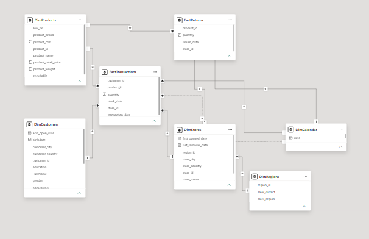
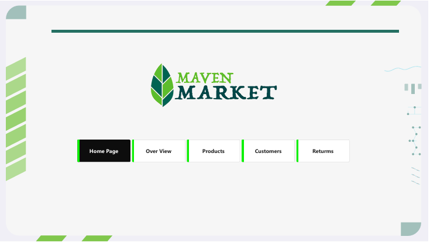
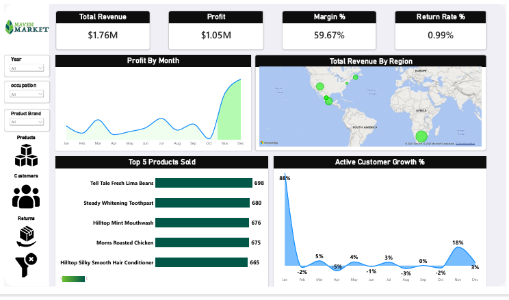
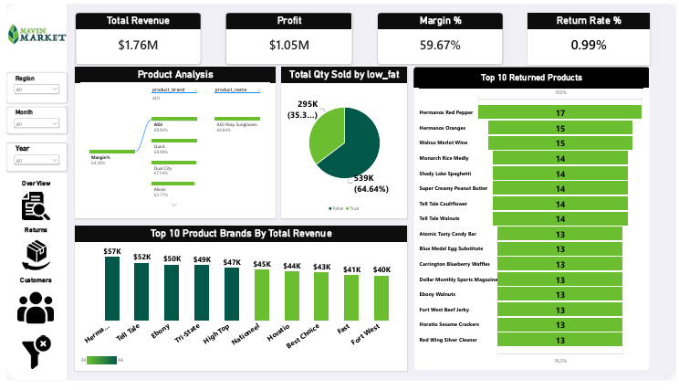
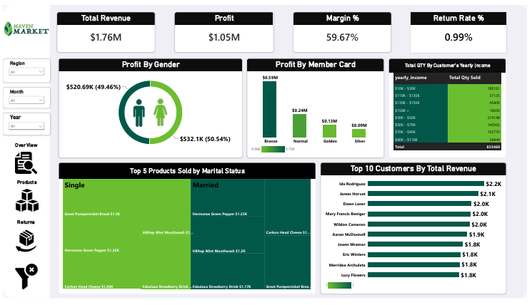
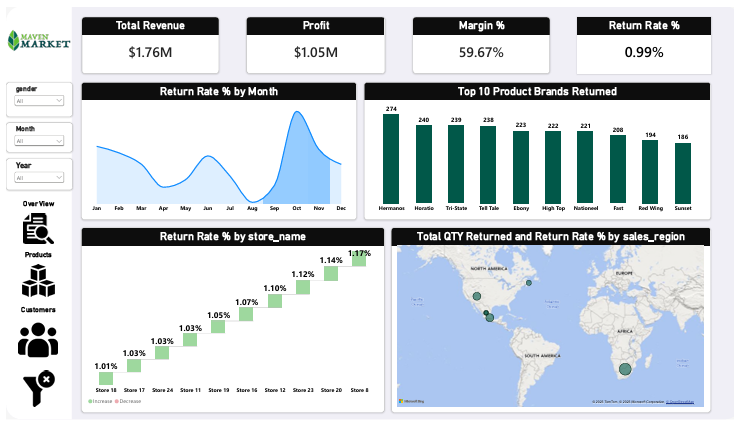

# Maven Market Power BI Dashboard

An interactive Power BI dashboard for monitoring retail sales, profitability, customer behavior, and product returns across Maven Market locations in Canada, Mexico, and the United States.

## Project Overview

This project transforms Maven Market retail data into a decision-ready Power BI report. It supports analysis of revenue, cost, profit, margin, customer behavior, product performance, and product returns.

Key business questions answered:

- How are revenue, profit, margin, and returns changing over time?
- Which regions, stores, products, and brands perform best or need attention?
- Which customer segments contribute the most revenue and profit?
- Where are the return-rate hotspots?

## Project Files

| File or folder | Description |
| --- | --- |
| `Market Project.pbix` | Power BI report with the model, measures, and visuals. |
| `MavenMarket_Calendar.csv` | Calendar dimension source. |
| `MavenMarket_Customers.csv` | Customer dimension source. |
| `MavenMarket_Products.csv` | Product dimension source. |
| `MavenMarket_Regions.csv` | Region dimension source. |
| `MavenMarket_Stores.csv` | Store dimension source. |
| `MavenMarket_Returns_1997-1998.csv` | Returns fact source. |
| `Transactions/` | Sales transaction source files. |

## Data Model

The report uses a **galaxy schema**: two fact tables share conformed dimensions. This structure keeps sales and returns as separate business processes while allowing consistent filtering by date, product, customer, store, and region.

### Fact Tables

| Table | Grain | Purpose |
| --- | --- | --- |
| `FactTransactions` | Transaction line | Stores sales activity, quantities, revenue, and cost inputs. |
| `FactReturns` | Returned item or transaction | Stores return activity for return-volume and return-rate analysis. |

### Dimensions

| Dimension | Purpose |
| --- | --- |
| `DimCalendar` | Year, quarter, month, and trend analysis. |
| `DimProducts` | Product, brand, category, cost, and retail-price analysis. |
| `DimCustomers` | Customer, gender, marital status, occupation, income, and membership analysis. |
| `DimStores` | Store-level operational analysis. |
| `DimRegions` | Region and geographic rollups. |

## Core KPIs

| KPI | Meaning | Typical calculation |
| --- | --- | --- |
| Total Revenue | Total sales value | Sum of sales revenue. |
| Total Cost | Cost associated with sold items | Sum of sales cost. |
| Profit | Net contribution before other expenses | `Total Revenue - Total Cost` |
| Margin % | Profitability relative to revenue | `DIVIDE(Profit, Total Revenue)` |
| Transactions Count | Number of sales transactions | Count of transaction records. |
| Quantity Sold | Number of units sold | Sum of sold quantity. |
| Quantity Returned | Number of units returned | Sum or count of returned items. |
| Return Rate % | Returned volume relative to sold volume | `DIVIDE(Quantity Returned, Quantity Sold)` |

> Use Return Rate % to compare regions or brands fairly. Use Quantity Returned beside it to understand the actual operational workload.

## Report Pages

### 1. Home Page

The landing page provides navigation to the core analytical pages: Overview, Products, Customers, and Returns.

### 2. Overview

The executive summary page tracks Total Revenue, Profit, Margin %, and Return Rate %.

| Visual | Purpose |
| --- | --- |
| Profit by Month line chart | Identifies profit trends and seasonality. |
| Total Revenue by Region map | Compares geographic sales performance. |
| Top 5 Products Sold bar chart | Shows the highest-selling products. |
| Active Customer Growth % trend | Tracks the growth of active customers. |

**Slicers:** Year, Customer Occupation, and Product Brand.

### 3. Products

This page evaluates profitability and return performance by product and brand. It includes Total Revenue, Profit, Margin %, Return Rate %, a product-category distribution visual, Top 10 Product Brands by Total Revenue, a Product Analysis decomposition tree, and a Top 10 Returned Products funnel.

**Slicers:** Month, Year, and Sales Region.

### 4. Customers

This page analyzes high-value customers and customer segments. It includes Total Revenue, Profit, Margin %, Return Rate %, Profit by Gender, Total Quantity by Customer Yearly Income, Top 5 Products Sold by Marital Status, Top 10 Customers by Total Revenue, and Profit by Member Card.

**Slicers:** Month, Year, and Sales Region.

### 5. Returns

This page investigates the size, trend, and location of returns. It includes Total Revenue, Profit, Margin %, Return Rate %, Return Rate % by Month, Top 10 Product Brands Returned, a returns waterfall chart, and a geographic map for return hotspots.

**Slicers:** Month, Year, and Customer Gender.

## How to Use the Report

1. Open `Market Project.pbix` in Power BI Desktop.
2. Start from the Home Page and choose an analytical page.
3. Use the page slicers to narrow the time period, geography, product, or customer segment.
4. Select bars, map bubbles, or chart segments to cross-filter the related visuals.
5. Hover over visuals to view detailed tooltips.
6. Use the eraser icon in a slicer to clear its selection and restore the default view.

## Tools

- Power BI Desktop
- Power Query
- DAX
- CSV data sources
